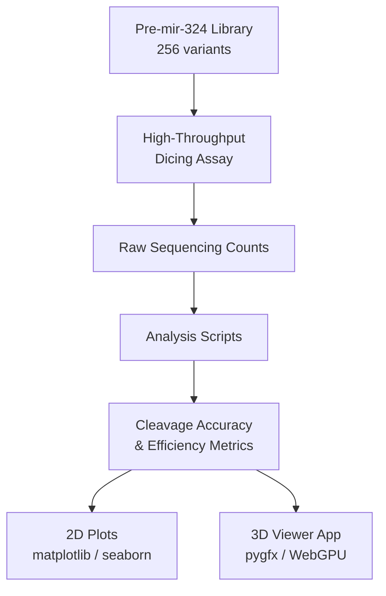
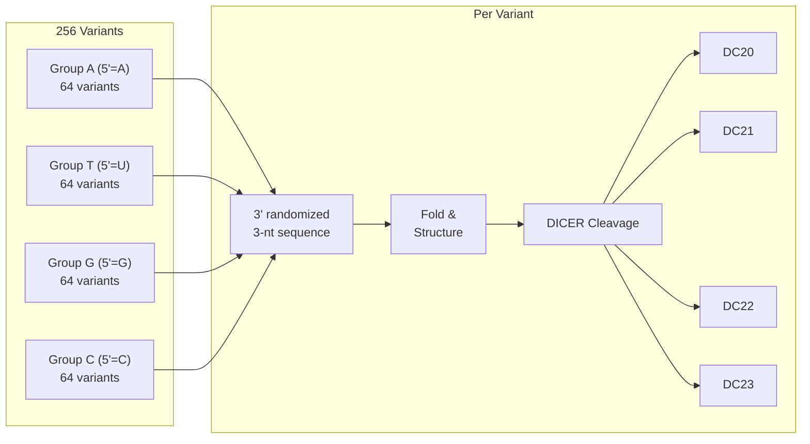
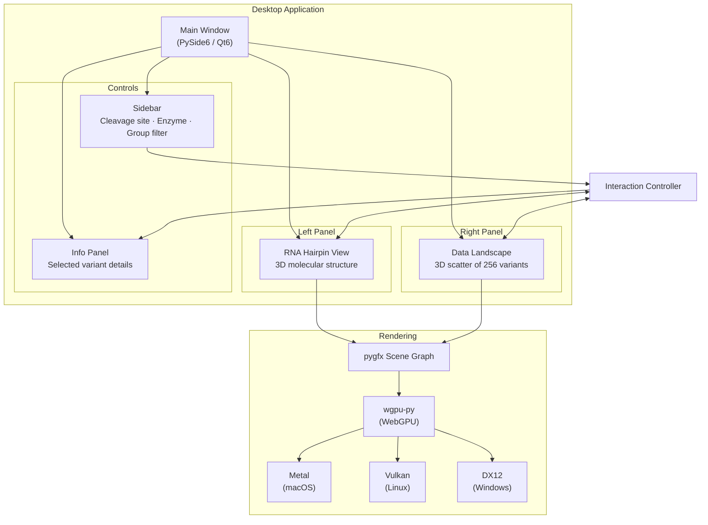
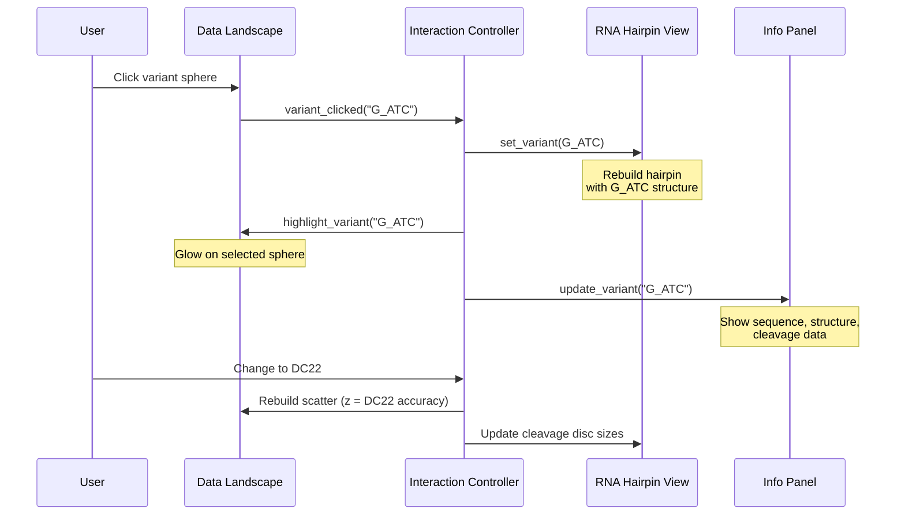

# expocket — Pre-miRNA DICER Cleavage Analysis & 3D Visualization

Analysis of how terminal nucleotide identity and structural features (YCR motif, overhang) control DICER cleavage site selection and accuracy on pre-miRNA substrates, with an interactive 3D visualization application.

## Project Overview

This repository contains two components:

1. **Analysis scripts** — Python scripts for processing high-throughput dicing assay data from a randomized pre-mir-324 library
2. **3D Viewer** — A GPU-accelerated desktop application for interactive 3D visualization of the sequence and cleavage data



## Analysis Scripts

| File | Description |
|------|-------------|
| `hsa_324_data_khoa.py` | Human DICER analysis of pre-mir-324 library (PNK/non-PNK conditions). Heatmaps, boxplots, reproducibility, DC21/DC22 accuracy, logo plots. |
| `dme_324lib_3repeat_khoa.py` | Fly Dicer-1 (DCR-1) analysis of pre-mir-324 library. Cross-species comparison with human DICER. |
| `YCR_end.py` | Analysis of YCR motif and 5'-nucleotide coordination in human pre-miRNAs (miRGeneDB data). |

### Experimental Design



### Key Metrics

- **Cleavage accuracy** — proportion of reads at a specific cleavage site relative to total reads for that variant
- **Positional efficiency** — log2-ratio of cleavage product RPM to control RPM at a specific position
- **Global efficiency** — log2-ratio of total cleavage product RPM to control RPM for a variant

## 3D Viewer Application

A standalone, cross-platform desktop application with two linked 3D panels for exploring the cleavage data interactively.

### Architecture



### Panels & Interactions



### Features

| Feature | Description |
|---------|-------------|
| **RNA 3D hairpin** | Nucleotide bases as colored spheres, backbone as spline tube, hydrogen bonds between paired bases |
| **Cleavage site markers** | Semi-transparent discs at DC20–DC23 positions, sized by cleavage accuracy |
| **Data landscape** | 256 variant spheres in a 4-group × 8×8 grid, height = accuracy, color = nucleotide group |
| **Cross-panel linking** | Selecting a variant in the landscape updates the RNA structure and info panel |
| **Enzyme toggle** | Switch between Human DICER and Fly DCR-1 datasets |
| **Group filtering** | Show/hide variants by 5' nucleotide group (A, T, G, C) |
| **Mock data** | Automatically generates realistic demo data when experimental files are unavailable |

### Running the Viewer

```bash
# Create and activate virtual environment
python3 -m venv .venv
source .venv/bin/activate    # macOS/Linux
# .venv\Scripts\activate     # Windows

# Install
pip install -e .

# Launch
python -m viewer
```

### Module Structure

```
viewer/
  __main__.py              Entry point
  app.py                   Main window (dual-panel layout)
  config.py                Colors, helix parameters, paths
  data/
    schema.py              VariantInfo, CleavageRecord, VariantDataset
    loader.py              Load TSV data files
    mock_data.py           Generate demo data
  rna3d/
    layout.py              Dot-bracket → 3D coordinates (A-form helix)
    scene.py               pygfx scene graph for RNA hairpin
    widgets.py             Qt widget with embedded pygfx canvas
  landscape/
    scene.py               pygfx scene graph for variant scatter
    widgets.py             Qt widget with embedded pygfx canvas
  interaction/
    controller.py          Cross-panel selection synchronization
  ui/
    sidebar.py             Filter & display controls
    info_panel.py          Variant detail display
```

## Dependencies

- **Python** ≥ 3.10
- **pygfx** + **wgpu** — GPU-accelerated 3D rendering via WebGPU
- **PySide6** — Qt6 desktop windowing
- **pandas**, **numpy**, **scipy** — data handling
- **matplotlib**, **seaborn** — 2D plotting (analysis scripts)
